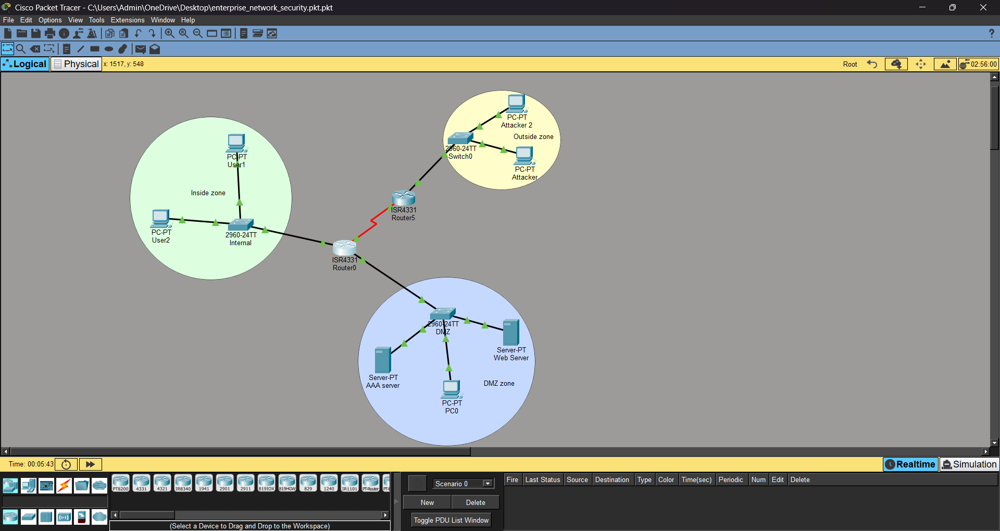

# Enterprise Network Security (Cisco Packet Tracer)

## Description
This project simulates a secure enterprise network with centralized authentication and layered security mechanisms.

## Features
- Configured routers and switches
- Implemented AAA authentication (TACACS+ with local fallback)
- Applied Access Control Lists (ACL) to control traffic
- Configured Zone-Based Firewall (ZPF) for network protection
- Enabled Intrusion Prevention System (IPS)
- Simulated attacker activity and tested security policies

## Network Topology

## Access Information

For testing purposes:

- Device: Router0  

- Username: admin1  
  Password: admin1password  

- Shared Secret Key: secret_key  

*Credentials are configured on Router0 for demonstration purposes.*

## Technologies
- Cisco Packet Tracer  
- Networking (Routing & Switching)  
- AAA (Authentication, Authorization, Accounting)  
- ACL (Access Control Lists)  
- Zone-Based Firewall (ZPF)  
- Intrusion Prevention System (IPS)  

## Project Goal
To demonstrate how enterprise networks are secured using layered defense (AAA, ACL, Firewall, IPS).
